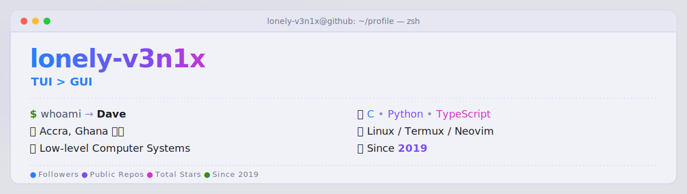

<a href="https://github.com/lonely-v3n1x">
  <picture>
    <source media="(prefers-color-scheme: dark)" srcset="dark_mode.svg">
    <source media="(prefers-color-scheme: light)" srcset="light_mode.svg">
    
  </picture>
</a>

---

### 👋 About Me

```yaml
name:       Dave
alias:      lonely-v3n1x
based_in:   "Accra, Ghana 🇬🇭 — Africa 🌍"
bio:        "Just a youth from Africa who is extremely interested in Tech"
currently:
  building:  "terminal tools in C & my TypeScript portfolio"
  learning:  "Low Level Computer Systems"
interests:  [systems / low-level, python automation, termux & android, web dev]
philosophy: "TUI > GUI"
```

---

<div align="center">

### 📊 GitHub Stats

<!--
  NOTE: The official github-readme-stats.vercel.app public instance is currently
  PAUSED globally, so these cards use a community mirror
  (github-readme-stats-eight-theta.vercel.app). For long-term reliability you can
  self-host your own free instance on Vercel (https://github.com/anuraghazra/github-readme-stats#deployment-)
  and replace "github-readme-stats-eight-theta.vercel.app" with your own URL.
-->
<table>
  <tr>
    <td align="center"></td>
    <td align="center"></td>
  </tr>
</table>

<br/>


</div>

---

<div align="center">

### 🛠️ Tech Stack

**`Languages`**


**`Tools & Platforms`**


**`Currently Exploring`**


</div>

---

<div align="center">

### ⭐ Featured Projects

<table>
  <tr>
    <td width="50%" align="center">
      <a href="https://github.com/lonely-v3n1x/TUI_MusicPlayer"><b>🎵 TUI_MusicPlayer</b></a><br/>
      <sub>A simple Terminal UI music player</sub><br/><br/>
      
      
    </td>
    <td width="50%" align="center">
      <a href="https://github.com/lonely-v3n1x/Termux-AI"><b>🤖 Termux-AI</b></a><br/>
      <sub>AI helper running on Termux</sub><br/><br/>
      
      
    </td>
  </tr>
  <tr>
    <td width="50%" align="center">
      <a href="https://github.com/lonely-v3n1x/ELK_BLE-CONTROL"><b>💡 ELK_BLE-CONTROL</b></a><br/>
      <sub>Python control for ELK BLE LED strips</sub><br/><br/>
      
      
    </td>
    <td width="50%" align="center">
      <a href="https://github.com/lonely-v3n1x/contact-bat"><b>📇 contact-bat</b></a><br/>
      <sub>A bat/cat-like viewer for <code>.vcf</code> files</sub><br/><br/>
      
      
    </td>
  </tr>
  <tr>
    <td width="50%" align="center">
      <a href="https://github.com/lonely-v3n1x/VehicleRentalSystem"><b>🚗 VehicleRentalSystem</b></a><br/>
      <sub>Java Swing vehicle rental application</sub><br/><br/>
      
      
    </td>
    <td width="50%" align="center">
      <a href="https://github.com/lonely-v3n1x/profile"><b>🌐 profile</b></a><br/>
      <sub>My personal portfolio</sub><br/><br/>
      
      
    </td>
  </tr>
</table>

> 👀 See something interesting? Star it ⭐ and feel free to fork — every repo has a story behind it.

</div>

---

### 🔭 Currently

- 🔭 **Working on** — terminal tools in C & polishing my TypeScript portfolio
- 🌱 **Learning** — Low level Computer Systems
- 👯 **Open to** — collaborating on cool open-source projects, especially systems & CLI tools
- 💬 **Ask me about** — Termux, C, Python scripting, anything that lives in a terminal
- ⚡ **Fun fact** — I'd rather live in a terminal than a GUI

---

<div align="center">

### 📫 Connect With Me

<a href="https://github.com/lonely-v3n1x"></a>
<a href="https://github.com/lonely-v3n1x?tab=repositories"></a>

<!-- ── Add your own links (uncomment & fill in) ───────────────────────────────
<a href="mailto:you@example.com"></a>
<a href="https://twitter.com/yourhandle"></a>
<a href="https://www.linkedin.com/in/yourhandle"></a>
<a href="https://discord.com/users/yourid"></a>
────────────────────────────────────────────────────────────────────────── -->

</div>

---

<div align="center">


<br/><br/>

 🚀

<br/>

</div>
